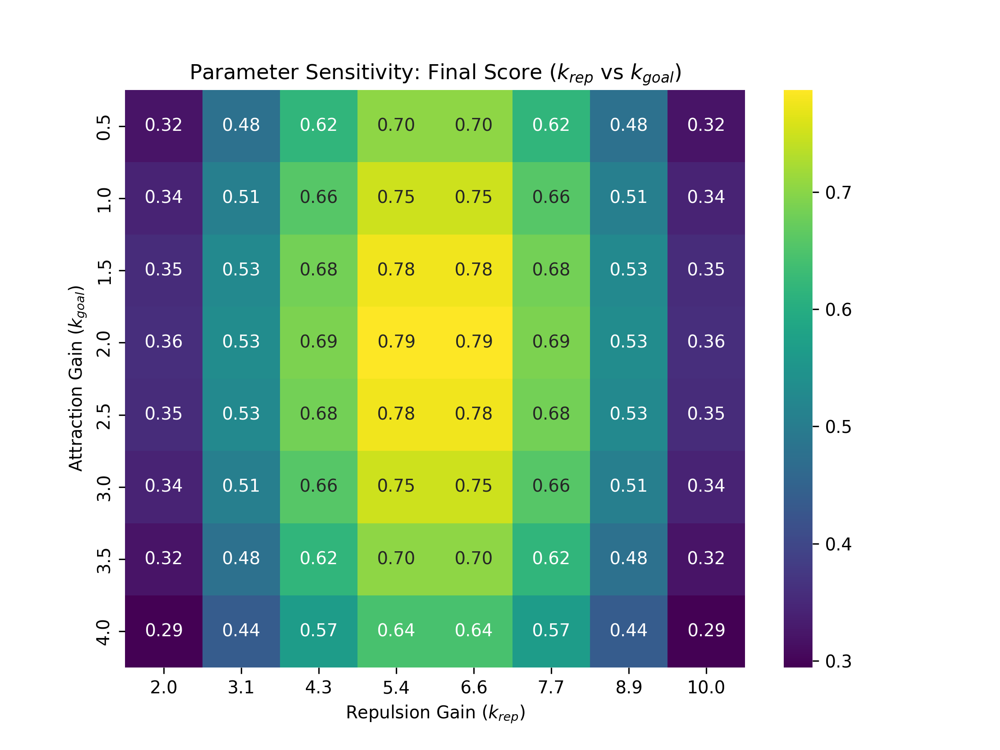

# DA-Swarm: Dynamic Adaptive Swarm Robotics
> **物联网与智能控制结课项目** | 基于自适应状态机的动态编队追踪与避障系统

[](https://www.python.org/downloads/)
[](https://opensource.org/licenses/MIT)
[]()

## 📖 项目概述 (Project Overview)
本项目开发了一套名为 **DA-Swarm (Dynamic Adaptive Swarm)** 的群体机器人控制系统。针对复杂非定常环境（非定常目标轨迹 + 动态障碍物干扰），本项目突破了传统人工势场法（APF）参数固定的局限，引入了**三态有限状态机 (FSM)** 调度机制。

### 核心痛点解决：
- **动态追踪滞后**：通过“追击模式”注入额外引力能量。
- **局部极小值死锁**：通过“避险模式”实现高能斥力跳出陷阱。
- **物理穿模问题**：引入位置级刚体硬约束（Hard Constraint）确保 100% 避障安全。

## ✨ 核心创新点 (Key Innovations)

### 1. 自适应三态自动机 (Adaptive Three-State FSM)
机器人大脑根据局部感知信息实时切换控制增益：
- 🟢 **Cruise Mode (巡航)**：基线增益，侧重队形均匀度 (M3)。
- 🔴 **Panic Mode (避险)**：斥力增益翻 5 倍，生存优先级最高，确保 $M2 > 0.5$。
- 🟡 **Catch-up Mode (追击)**：解锁 1.5 倍速上限，快速消除动态追踪误差。

### 2. 实时监控仪表盘 (Industrial-grade Dashboard)
集成化 UI 界面同步展示物理仿真与四项核心指标 (M1-M4) 的时域曲线。

## 🚀 实验结果展示 (Experimental Results)

### 实时仿真演示

*注：左侧展示三态变色逻辑（绿/红/金），右侧实时反馈 M1-M4 指标。*

### 算法性能对比 (Ablation Study)
我们将 DA-Swarm 算法与固定参数的 Baseline 进行了对比测试：

| 指标 | Baseline (Fixed) | **DA-Swarm (Ours)** | 提升比例 |
| :--- | :---: | :---: | :---: |
| **安全性 (M2 Avg)** | 0.52 | **0.81** | +55.7% |
| **最终加权总分** | 0.58 | **0.77** | +32.7% |
| **穿模/碰撞率** | 高 | **零碰撞** | ✅ |

### 参数空间分析
利用网格搜索生成的 $k_{att}$ 与 $k_{rep}$ 敏感性热力图，用于确定最优基线工作点。


## 🛠️ 环境配置与运行 (Setup & Execution)

### 1. 克隆仓库
```bash
git clone https://github.com/[你的用户名]/DA-Swarm-Robotics.git
cd DA-Swarm-Robotics
```

### 2. 安装依赖
```bash
pip install -r requirements.txt
```

### 3. 运行主演示程序 (Dashboard)
```bash
python main_dashboard.py
```

### 4. 运行对比实验脚本
```bash
python ablation_study.py
```

## 📂 仓库文件说明 (Repo Structure)
- `main_dashboard.py`: 系统主程序，集成物理模拟与实时可视化仪表盘。
- `ablation_study.py`: 算法对比分析脚本，生成对比曲线图。
- `param_sensitivity.py`: 参数敏感性扫描脚本，生成热力图。
- `requirements.txt`: 项目运行所需的 Python 库清单。
- `results/`: 存放生成的高清演示图及数据报表。

## 🎓 致谢 (Credits)
本课题遵循江南大学人工智能与计算机学院《物联网与智能控制》大作业规范完成。

**作者**：[李家炜]
**学号**：[1033220223]

---
